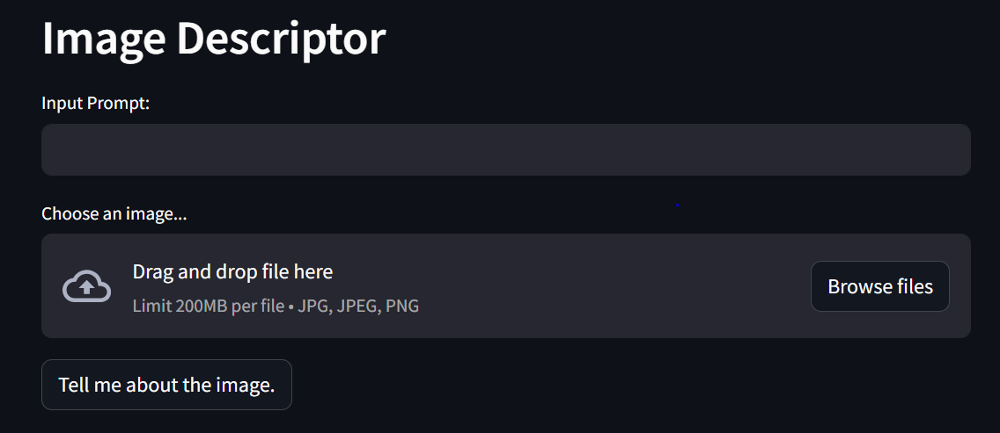

### Image Descriptor

Overview:
Developed an Image Descriptor.
User interface built using the Streamlit application.

Backend Model:
Utilized the Gemini Pro Vision model at the backend.
Gemini Pro processes user input image and generates description about the image.

User Interaction:
Interface includes a dialogue box for users to input queries and a browse button to upload files.

Image 1: Represents the developed user interface, showcasing the design and layout.

Image 2: Depicts a user inputting their query into the dialogue box for interaction and uploading the input image.

Image 3: Illustrates the response generated by the application based on the user's input.
